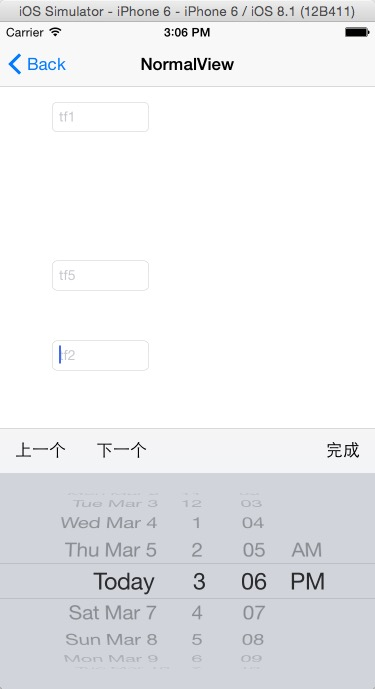
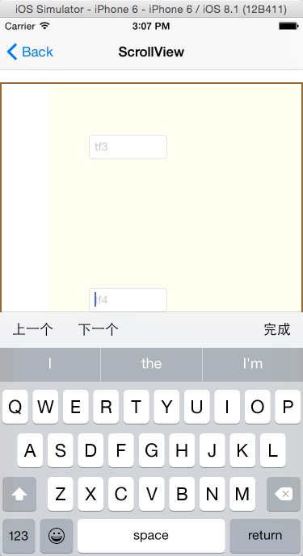

    Charlin出框架的目标：简单、易用、实用、高度封装、绝对解耦！

# CoreTFManagerVC
强大的键盘躲避管理器，完全解耦版本，支持ScrollView！ 

    注：本框架是大修改版本，之前的版本已经被无情的淘汰，请使用的朋友注意更新。觉得不错的请给星星。

  

##框架特性： 
>.向下兼容到ios 6.0. 
>.完全解耦，不需要继承，不需要定义成员属性，类方法直接搞定一切。 
>.自动管理生命周期，你只需要使用即可，不需要管理控制器的生命周期。本框架效仿百度地图的生命周期管理方案，后面使用会详细说明，此方案最合理。 
>.支持普通视图，新版本主要是解耦以及增加scrollView的支持。 
>.支持自定义键盘。自动placeHolder处理。 
>block封装，不需要任何代理，甚至你连键盘躲避管理器的对象实例都看不到。 
>.scrollView支持contentInset。 
>.支持所有设备，包括横竖屏。 
>.封装了强大的键盘工具条，不需要再担心屏幕小不好切换或者退下键盘了。 
>.做了比较多的性能优化，最大必的提高性能。 
>.完善的错误处理机制。 
>.完善的动画效果及不同键盘切换动画效果，动画曲线效果。 
>.insetsBottom表示这个文本输入框是否需要向下多留一点空白，一般是文本框下面有提示类文字或者提交类按钮可以设置此值。
>.完善的内存管理。   

    示例中有一个pickerView，你会觉得选了没值？那是因为没有处理，因为这个处理是和本框架无关的操作

##Charlin想说： 
a.本次框架的制作真可谓历经千辛万苦，本来最开始做了一个版本，没有解耦，需要你去继承，然后一个朋友essue我说明了这个情况我当时就
在想怎么解耦。，然后现在的项目（还比较大）直接使用了这个框架，用起来几乎完美，我的几个同事直接使用了也没有问题。

b.所以当时感觉功能还比较完善就没有想过要去改这个框架。后来在做一个注册页面的时候，页面比较长，里面有很多输入框，所有的textField直接
放在了一个大的scrollView里面，问题就来了，整个框架就乱了。这才感觉必须要重新改写框架。

c.整个框架这次基本写了30个小时左右，其中遇到很多的问题，最麻烦的问题就是scrollView在躲避键盘移动的时候，在依次的点【下一个】的时候需要先吃掉contentSize，
吃完自己的contentSize再去修改transform，然后到了最底部，再依次的点【上一个】的时候，需要反过来，先精确计算退还transform，
退完了再把contentSize释放，同时在点击上一个或者下一个的时候，用户是可以再拖动scrollView改变当前的contentOffset,导致整个计算异常
复杂，我总共写了5个版本，前4个版本异常复杂，代码量达到1000行以上。

d.最终精疲力尽的时候，查看了github上10来个类似的国外写的东西，转换了思路，用最简单的方式完成了整体框架，完成后感觉非常开心。在这里
分享给大家。

  

##使用示例
    //安装：请在viewDidAppear中完成
    -(void)viewDidAppear:(BOOL)animated{
    
        [super viewDidAppear:animated];
    
        [CoreTFManagerVC installManagerForVC:self scrollView:self.scrollView tfModels:^NSArray *{
            UIDatePicker *picker=[[UIDatePicker alloc] initWithFrame:CGRectMake(0, 0, self.view.bounds.size.width, 200)];
    
            
            TFModel *tfm1=[TFModel modelWithTextFiled:_tf1 inputView:nil name:@"tf1" insetBottom:0];
            TFModel *tfm2=[TFModel modelWithTextFiled:_tf2 inputView:picker name:@"tf2" insetBottom:0];
            TFModel *tfm3=[TFModel modelWithTextFiled:_tf3 inputView:nil name:@"tf3" insetBottom:30];
            TFModel *tfm4=[TFModel modelWithTextFiled:_tf4 inputView:nil name:@"tf4" insetBottom:0];
            TFModel *tfm5=[TFModel modelWithTextFiled:_tf5 inputView:nil name:@"tf5" insetBottom:0];
            TFModel *tfm6=[TFModel modelWithTextFiled:_tf6 inputView:nil name:@"tf6" insetBottom:0];
            
            return @[tfm1,tfm2,tfm3,tfm4,tfm5,tfm6];
        
        }];
    }
  
    //卸载：请在viewDidDisappear中完成
    -(void)viewDidDisappear:(BOOL)animated{
        
        [super viewDidDisappear:animated];
        
        [CoreTFManagerVC uninstallManagerForVC:self];
    }
  
    
##示例截图
 
 
 
  
  
  

   
我的事业
===============
西成的事业，渺小而艰难的求生存。前期我们专做全国的移动app外包。如果您能在信息上援助我们，我们万分感谢您的帮助！ 
西成：[http://ios-android.cn](http://ios-android.cn)  
我的个人微博：[http://weibo.com/charlin2015/](http://weibo.com/charlin2015/) 
  
三群： 474377358 
四群： 347446259 
西部省市朋友加群号： 473185026（实名） 
swift群： 467237044 
